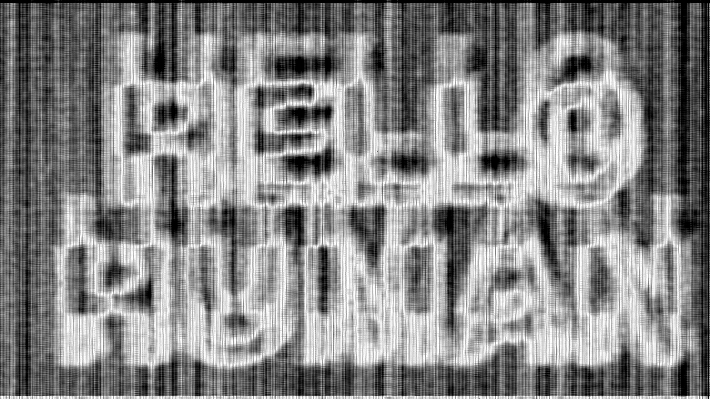
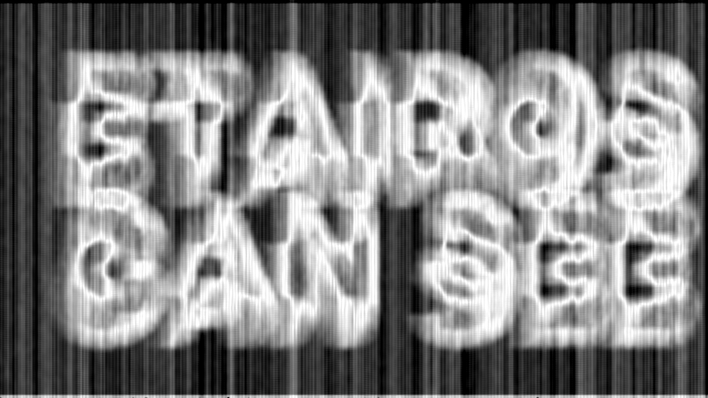

# read_ghost

Teach a machine to read a **ghost font**.

A ghost font (see [mixfont.com/ghost-font](https://www.mixfont.com/ghost-font)) hides text in
**pixel motion**. Any single frame of the video is pure static. The time-average of all frames
is also flat noise. The letters exist only in *coherent motion*: inside a glyph every pixel
drifts the same way, in the background the drift is random. Human vision integrates common
motion and reads the words. A screenshot cannot.

The claim is that only humans can read it. This repo reads it with ~60 lines of classical
signal processing. No neural network, no OCR model, no AI at runtime.

## Sample decodes

| Input | Machine output |
|-------|----------------|
| ghost video 1 (static to any single frame) |  |
| ghost video 2 |  |

## How it works

1. Split the clip into frames (`ffmpeg`).
2. Estimate the per-pixel optical-flow vector for every consecutive frame pair
   (Lucas-Kanade, plain numpy + scipy).
3. Average the flow vectors over the whole clip. Random background motion cancels toward
   zero; coherent glyph motion survives the average.
4. The **magnitude of the averaged flow field** is the hidden text.

This is a direct mechanization of what your visual cortex does: motion integration over time.
Full build notes, including the dead ends: [NOTES.md](NOTES.md).

## Does it use AI?

No. The decoder is 1981-era computer vision (Lucas-Kanade optical flow) plus averaging.
An AI assistant *designed* the decoder, but the decoding itself is deterministic math that
runs the same on any machine. Anyone, human or machine, can read the output image. Details
in [NOTES.md](NOTES.md#does-it-use-ai).

## Use

Needs `ffmpeg` on PATH.

```bash
pip install -r requirements.txt
```

CLI (file or URL):

```bash
python ghostreader.py ghost.mp4 -o decoded.png
python ghostreader.py https://example.com/ghost.mp4 -o decoded.png
```

Web page (paste a URL or drop a file):

```bash
python app.py
# open http://127.0.0.1:5000
```

Make your own ghost video at [mixfont.com/ghost-font](https://www.mixfont.com/ghost-font) and
feed it in.

## Tuning

- `--win` flow smoothing window (bigger = smoother, fatter strokes)
- `--downscale 2` halves resolution for speed
- `--no-invert` light text on dark

## License

MIT. Built by Matt Lucas, RedEye Security.
